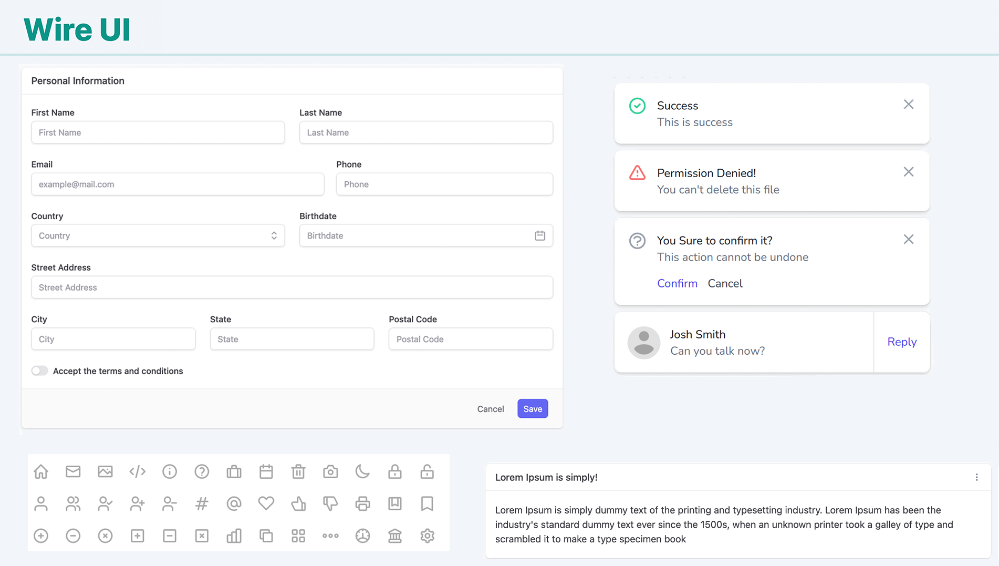

# Admin dashboard (Laravel)

Admin UI is a library of components and resources to empower your Laravel and Livewire application development.

Starting a new project with Livewire can be time-consuming when you have to create all the components from scratch. Wire UI helps to skip this step and get you straight to the development phase.

---

If you are looking for the version with support to tailwind v2, please check out [Support Tailwind v2](https://deprecated.livewire-wireui.com)

---

    

        
    

🔥 You get with Wire UI:

- Form and UI components
- Notifications
- Confirmation notifications
- All Heroicons

🌱 This project is in active development. Track all changes in the project [Changelog].

 

<h2> 🚀 Get Started</h2>

Please visit our [Get Started] page for requirements and a step-by-step installation guide.

 

<h2>📣 Follow the author</h2>

Stay informed about Admin UI, follow [@ph7jack] on Twitter.

There will you see all the latest news about features, ideas, discussions and more...

 

<h2> 💡 Philosophy</h2>

WireUI is and will always be FREE to anyone who would like to use it.

This project is created [Pedro Henrique], and it is maintained by the author with the help of the community.

All contributions are welcome!

 

## License

MIT

